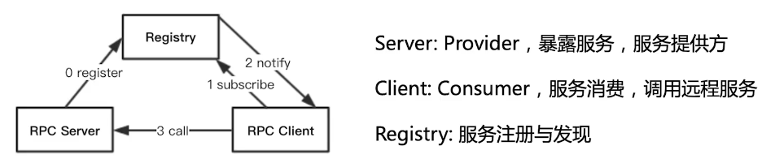

[TOC]

# RPC理论

## RPC概念

1. 是什么？
   RPC：Remote Procedure Call，远程过程调用。
   - Remote - 跨服务、进程、物理机
   - Procedure - 一段可执行代码
   - Call - 调用
   - 是分布式系统常见的一种通信方法
   - 远程调用：
     - 把进程内部的部分逻辑放到其他机器上去执行，即业务拆解。
     - 让每个服务仅对单个业务负责，使得服务具备独立的可扩展性、可升级性、易维护性
   - 过程调用：
     - 程序内控制和数据的传输
   
2. 做什么？
   
   提供跨进程交互形式：RESTful、WebService、HTTP、基于DB做数据交换、基于MQ做数据交换，以及RPC。
   
   - 依赖存储中间件做数据交互：
     - MySQL、RabbitMQ、Kafka、Redis
     - 两个系统是异步的
   - 直接交互：
     - RESTful、WebService、RPC、HTTP
     - 客户端与服务端同步
   
   > RPC将Client和Server通信细节封装，Client提供调用方法名、参数、返回值信息，Server解析报文，执行对应方法然后将返回值返回
   
3. 为什么要使用RPC？
   用于建立分布式计算（服务）

4. 专业术语

   - Client：服务调用方，作用是通过Client-stub向服务提供方Server发起调用，并且接受从Client-stub返回的调用结果；
   - Client-stub：
     - 服务调用方的本地存根对象，是一个可执行体；
     - 类似于反射获得的invoke；
     - 作用是①将需要远程调用的接口、方法及参数通过约定好的协议进行序列化，②将序列化的数据通过RpcRuntime对象进行传输，③将服务提供方的返回值序列化为Client可以直接使用的对象；
   - RpcRuntime：远程调用运行时的对象，存在于服务双方。作用是建立起双方的连接，以便进行远程通信；
   - Server-stub：
     - 服务提供方的本地存根对象；
     - 作用是①将从RpcRuntime中读取的数据进行反序列化，②调用本地方法，③把返回值进行序列化传输到RpcRuntime进行发送；
   - Server：服务提供方，提供服务的业务逻辑，Server-stub调用的本地方法就是Server中的方法。

5. RPC、分布式本身的问题：

   - 通信延迟
   - 地址空间被隔离
   - 局部故障：发生的概率变高，定位变难
   - 并发问题：多个服务调一个服务

## 现有框架对比

|gRPC|thrift|RMI|dubbo|HadoopRPC
--|--|--|--|--|--
开发语言|多语言|多语言|Java|Java|Java
序列化|protobuf|thrift格式|Java序列化|hession2|R/Writable
注册中心|×|×|JDK自带|Zk等|×
跨语言|√|√|×|×|×
服务定义|Protobuf文件|Thrift文件|Java接口|Java接口|Java接口
服务治理|×|×|×|√|√

## 原理剖析

### 服务暴露和引用过程



1. 服务暴露
   服务暴露过程就是将服务绑定到端口（用作Client调用服务的地址）的过程。
   - 暴露到本地：用于业务划分，让服务职责划分变清晰
   - 暴露到远程：使得 **host:port** 作为服务的唯一标识。
     - 直接暴露式：创建接口实现类代理，绑定至端口，等待调用
     - 注册中心式：创建接口实现类代理，绑定至端口，同时注册到注册中心
2. 服务引用
   服务引用过程就是Client和Server服务建立连接的过程。
   大致分为2个步骤：①连接Server；②创建接口代理
   - 直连式：Client直接根据**host:port**连接远程服务。一般用于服务测试；
   - 注册中心式：Client通过注册中心来获取**host:port**，然后再进行服务调用；这种方式还可以让注册中心保存Client的**host:port**用于及时通知Client更新服务地址变更

### 方法调用过程

完成服务暴露和引用后，就可以在Client利用代理对象发起方法调用。


1. Client执行Server的一个方法：必须传输 ①方法的全限定名 以及 ②方法参数列表 给Server
2. Client和Server传输的请求包按照约定好的统一序列化协议进行序列化
3. Client将序列化后的数据通过RpcRuntime进行传输，RpcRuntime进行等待\监听
4. Server通过RpcRuntime接收请求包，传递给Server-stub；
5. Server-stub ①用统一的序列化协议进行反序列化，解析请求数据，②根据解析的数据来定位需要调用的具体方法，将方法参数列表传递给Server；
6. Server 执行对应的方法，并返回执行结果给 Server-stub；
7. Server-stub 将结果序列化后传递给RpcRuntime；
8. Server 的 RpcRuntime 将返回结果发送给 Client 的 RpcRuntime；
9. Client 的 RpcRuntime 把接收到的数据传输给 User-stub；
10. User-stub 将返回结果反序列化后传递给最初的调用方，继续后续逻辑处理。

### 注册中心

#### 何为注册中心

##### 注册中心是什么?

注册中心：

- 在Server暴露服务时往其中注册服务，在Client服务引用时从中获取服务的地址
- 本身是一种服务，用于管理服务的一些信息，如：Server、Client的地址信息，服务接口的全限定名，并管理信息间的关系：
  - 服务接口全限定名 - Server地址：一对多，集群关系，保证服务的高吞吐、高可用；
  - 服务接口全限定名 - Client地址：多对一；
  - Server地址 - Client地址：关系不确定，无直接关联

##### 注册中心存在的意义是什么?

1. 直连的弊端：
   - 运行时：Client对Server地址的耦合依赖，Server地址改变，Client需修改配置；
   - Server崩溃：Server崩溃导致服务调用失败，Client只能去选择集群中的其他Server；
   - 新增Server：当某服务在集群中增加Server，只有在配置集群地址的地方手动去新增机器地址；
2. 注册中心的好处：
   - Client 和 Server 解耦；
   - Server可以从注册中心得知与自己通信的Client数，以便为限流策略提供数据支持；
   - 注册中心可以将通信超时的对应节点移除，防止其他Client再次获取到不可用Server地址；
   - 横向变化：注册中心可以感知到Server机器数的变化，并动态通知订阅响应服务的Client；
   - 纵向扩展：注册中心可以直接注册新服务，而不需要重新部署；

##### 注册中心存在的问题

1. 单个注册中心的单点故障问题；
2. 多个注册中心的一致性问题：针对分布式中数据一致性问题，涉及CAP定理。一致性(C)、可用性(A)、分区容错性(P) 做选择权衡；

#### 用zookeeper打造注册中心

##### zookeeper简介

zookeeper 是 Apache 开源的一个分布式协调服务，用于协调和同步多个服务器之间的状态；

分布式应用程序可以使用其公开的一组简单原语进行构建，实现更高级别的服务，以实现同步，配置维护及组合命名；

zookeeper的目的就是减轻分布式应用实施协调服务的责任；

###### 1. zookeeper数据模型
   
   zookeeper数据模型是一颗树，每个节点是zookeeper的一个数据节点ZNode（由Client创建）。数据的路径及命名规则与文件系统类似，以”/“划分每个层级；
   每个ZNode都保存着自己的数据内容及一系列属性信息，如版本信息、ACL和时间戳等；
   每个ZNode都有独立的生命周期，根据生命周期的不同及是否保证了节点的顺序，ZNode可分为持久节点、持久顺序节点、临时节点和临时顺序节点：
   - 持久节点：一旦创建，除非显示调用移除操作，否则一直保存在zookeeper服务中，即使创建它的Client断开或会话失效
   - 持久顺序节点：在持久节点的基础上，每个父节点会为其子节点（一代子）维护每个子节点创建的先后顺序信息。一般在创建的节点名称后自动添加该节点在其所在层级的顺序序号。
   - 临时节点：生命周期与Client绑定。
   - 临时顺序节点：在临时节点的基础上，……
###### 2. 一致性协议
   - 一致性协议：二阶段提交协议、三阶段提交协议、Paxos、Raft 协议等；
   - zookeeper的一致性协议：ZooKeeper Atomic Broadcast（原子消息广播协议），简称ZAB；
   - ZAB规定了改变ZooKeeper服务器上的数据状态的事务请求处理的流程。

下面从ZAB中的 **角色**、**流程**、**两种模式**、**多服务器事务同步** 来展开介绍：

1. 角色：

   - Leader节点：全局唯一，负责协调所要处理的事务，可以用作读\写操作。Leader的选举会发生在以下三个场景：
     - 集群初始化启动时；
     - Leader节点崩溃后；
     - Leader节点与集群中超过一半节点断连后；
   - Follower节点：Leader节点的副本，一般用于读操作。Follower服务器中有一种叫观察者节点，观察者节点不参与投票与选举，其余Follower节点参与投票和选举。
   
2. 流程：
    ① Zookeeper Client 随机连接到 Zookeeper 集群中的一个节点。对**写请求**，若不是Leader则该节点向Leader提交事务，Leader再**广播事务**；对**读请求**，直接从该节点**读取数据**；
    ② Client 事务请求到达 Leader服务器后，Leader服务器将该事务请求转化为一个**提议proposal**（每个proposal会分配一个全局的**zxid - 机器最高编号**），并将提议分发给集群中所有Follower服务器（分发至由Leader维护的**FIFO消息队列**中），然后等待Follower服务器的反馈；
    ③ Follower服务器如果正常，则会给予Leader服务器**正确反馈 - ACK报文**；
    ④ Leader服务器接收到半数以上的正确反馈，就向集群中所有Follower分发Commit消息，要求Follower服务器提交事务；

3. 两种模式：

   - 消息广播模式：正常的Client Transaction Request广播模式
     触发条件：Leader被选出，数据同步完成后切换到消息广播模式
     Leader 向对每个Follower维护的FIFO消息队列中，发送proposal
     ① 若收到半数以上ACK，分发Commit消息至FIFO中，开始提交事务；
     ② 否则丢弃该Leader，直接进入Leader选举。

   - 崩溃恢复模式：用于解决Leader服务器单点问题（网络中断、崩溃退出、重启等异常），并且在① 恢复（选举新Leader）后 ② 解决数据不一致问题
     触发条件：当Leader出现异常，zookeeper进入崩溃恢复模式，选举新的Leader；
     一个机器需要获得过半进程的支持才能称为Leader；
     ZAB需要一种Leader选举算法：① 快速、正确选举出Leader；② 其他机器能快速感知到；

     > ZAB规定：如果一个事务在一台机器上处理成功，则就算有机器崩溃，这个事务也被认为在所有机器上都处理成功，这个现象会导致两种数据不一致的情况：
     >
     > 1. Leader未提交，Follower提交：原Leader接收到请求，生成proposal，还未分发\仅分发部分该proposal就崩溃，选举出的新Leader可能不具备该proposal状态。
     > 2. Leader提交，Follower未提交：Leader提交后，尚未分发\仅分发部分Commit就崩溃；

     解决方案 - ZAB协议崩溃恢复需满足2个要求：

     1. 确保丢弃已经被Leader提出但未提交的proposal；
     2. 确保以及被Leader提交的proposal被所有Follower提交；

     因此能够满足条件的新Leader需满足条件：节点含有zxid的事务；

4. 多服务器数据同步：

   - 解决的问题：因为多台服务器导致的执行事务没有同步（不会同时执行）。而事务同步用于保证集群过半Follower数据状态与Leader一致；
   - 发生需求场景：
     - Leader被重新选举，需要进行数据同步；
     - 在集群中新添加服务器，该服务器会找到Leader服务器，进行数据同步；
   - 数据同步方法：Leader为每个Follower提供一个**FIFO队列**，将没有被Follower执行的事务的proposal发送至队列，并跟上commit消息，以表示事务以提交，当数据同步完成后，Leader服务器会将该Follower服务器加入到真正可用的机器列表中。

##### zookeeper作为注册中心

###### 优点

1. 数据模型简单
   
   清晰、简单地展示了注册中心中服务接口、Server地址信息以及Client地址信息之间的关系
2. 支持事件监听
   ZooKeeper有一个**Watcher机制**。用户可以在节点上注册一些Watcher，并且当一些特定事件触发的时候，ZooKeeper服务端会将事件通知到感兴趣的客户端上。
3. 崩溃恢复模式

###### 缺点

1. zookeeper设计原则是CP原则
   ① 在分布式系统的设计原则中CAP原则和BASE原则都有着举足轻重的地位；
   ② 一个分布式系统不能同时满足一致性(C)、可用性(A)、分区容错性(P)这三个基本要求，最多只能同时满足其中的两个；
   在AP原则和CP原则中，注册中心到底适用哪个原则：
   - 选择CP原则：在Leader崩溃，且只有2台Follower服务器时，无法选出新的Leader服务器；
   - 选择AP原则：**该原则更适合注册中心**，由于服务器挂掉，不同时刻查询到提供相同服务的服务器节点列表不同（数量不同），导致影响负载均衡效果，但是最终会趋于平衡；
2. zookeeper的写操作瓶颈：只通过Leader服务器进行写操作，新增的服务器节点只能提高读操作速度；

#### 用Nacos打造注册中心

##### Nacos简介

###### 1. Nacos数据模型

###### 2. 一致性协议

##### Nacos作为注册中心

###### Nacos支持AP原则和CP原则

###### 不同粒度的服务数据隔离

###### 丰富的健康检测机制

### 远程通信

#### 远程通信基础

#### Netty

#### Mina

#### Grizzly

### 协议

#### 自定义协议

#### 编解码

### 序列化

#### 序列化介绍

#### Fastjson

#### Kryo

#### Protobuf

### 动态代理

#### 动态代理介绍

#### JDK动态代理

#### CGlib动态代理

#### Javassist动态代理

### 集群

#### 负载均衡

#### 容错机制

#### 路由策略

### 跨语言RPC

#### 跨语言RPC原理

#### 各类跨语言RPC框架对比

## 技术栈介绍

1. 基础知识
   JavaCore、Maven、反射
2. 动态代理（生成client存根实际调用对象）
   Java的动态代理
3. 序列化（Java对象与二进制数据互转）
   fastjson
4. 网络通信（传输序列化后的数据）
   jetty、URLConnection

# RPC实战 - 代码实现

## 一：建工程

### 项目创建

1. Create New Project
2. maven -> jdk1.8
3. group：com.servyou -> Artificats：demoRPC
4. location：…/servyou/demoRPC

### 项目结构搭建

New -> Module…

1. demoRPC-common：通用工具方法模块
2. demoRPC-proto：协议模块
3. demoRPC-codec：序列化模块
4. demoRPC-transport：网络模块
5. demoRPC-server
6. demoRPC-client

### maven依赖配置

#### 公共依赖

所有模块都需要的依赖

声明在<dependencies> </dependencies>中

1. junit:4.12
2. lombok:1.18.8
3. slf4j-api:1.7.26
4. logback-classic:1.2.3

#### 依赖声明

子模块可能用到的依赖

声明在<dependencyManagement> </dependencyManagement>中

1. commons-io:2.5
2. jetty-servlet:9.4.19.v20190610
3. fastjson:1.2.44

### 工程编译版本

```java
<build>
    <plugins>
    	<plugin>
    		<groupId>org.apache.maven.plugins</groupId>
    		<artifactId>maven-compiler-plugin</artifactId>
    		<version>3.3</version>
    		<configuration>
    			<source>1.8</source>
    			<target>1.8</target>
    		</configuration>
    	</plugin>
    </plugins>
</build>
```

### 硬编码转properties

```java
<properties>
    <java.version>1.8</java.version>
    <commons.version>2.5</commons.version>
    <jetty.version>9.4.19.v20190610</jetty.version>
    <fastjson>1.2.44</fastjson>
    <lombok.version>1.18.8</lombok.version>
    <slf4j.version>1.7.26</slf4j.version>
    <logback.version>1.2.3</logback.version>
    <junit.version>4.12</junit.version>
</properties>
```


### lombok插件

1. File -> Settings…：ctrl + alt + S
2. Plugins -> lombok -> Install
3. Build, Execution, Deployment -> Compiler -> Annotation Processors -> √ Enable annotation processing

## 二：proto模块

```java
/**
 * @PackageName: com.pill
 * @ClassName: Peer
 * @Description: 表示网络传输的端点
 * @Author: SKY
 * @Data:: 2020/08/06
 */
@Data
@AllArgsConstructor
public class Peer {
    private String host;
    private int port;
}
```

```java
/**
 * @PackageName: com.pill
 * @ClassName: Request
 * @Description:
 * @Author: SKY
 * @Data:: 2020/08/06
 */
@Data
public class Request {
    private ServiceDescriptor service;
    private Object[] parameters;
}
```

```java
/**
 * @PackageName: com.pill
 * @ClassName: Response
 * @Description: 表示RPC返回
 * @Author: SKY
 * @Data:: 2020/08/06
 */
@Data
public class Response {
    /***
     * 服务返回编码：0-成功，非0失败
     */
    private int code = 0;
    /***
     * 具体的错误信息
     */
    private String message = "OK";
    /***
     * 返回的数据
     */
    private Object data;
}
```

```java
/**
 * @PackageName: com.pill
 * @ClassName: ServiceDescriptor
 * @Description: 表示服务
 * @Author: SKY
 * @Data:: 2020/08/06
 */
@Data
@AllArgsConstructor
@NoArgsConstructor
public class ServiceDescriptor {
    private String clazz;
    private String method;
    private String returnType;
    private String[] parameterTypes;
}
```


## 三：common模块

反射工具类

```java
public class ReflectionUtils {
    /**
     * 根据class创建对象
     * @param clazz 待创建对象的类
     * @param <T>   对象类型
     * @return  创建好的对象
     */
    public static <T> T newInstance(Class<T> clazz) {
        try {
            return clazz.newInstance();
        }catch (Exception e) {
            throw new IllegalStateException(e);
        }
    }

    /**
     * 获取某个class的公有方法
     * @param clazz 待获取方法的类
     * @return 当前类声明的公有方法
     */
    public static Method[] getPublicMethods(Class clazz) {
        Method[] methods = clazz.getDeclaredMethods();
        List<Method> pMethods = new ArrayList<>();
        for (Method m: methods
             ) {
            if (Modifier.isPublic(m.getModifiers())) {
                pMethods.add(m);
            }
        }
        return pMethods.toArray(new Method[0]);
    }

    /**
     * 调用指定对象的指定方法，并返回结果
     * @param obj 调用的对象
     * @param method 调用的方法
     * @param args 方法的参数
     * @return 返回值
     */
    public static Object invoke(Object obj, Method method, Object... args) {
        try {
            return method.invoke(obj, args);
        } catch (Exception e) {
            throw new IllegalStateException(e);
        }
    }
}
```


## 四：codec模块

## 五：transport模块 

## 六：Server模块

## 七：Client模块

## 八：gk-rpc使用案例